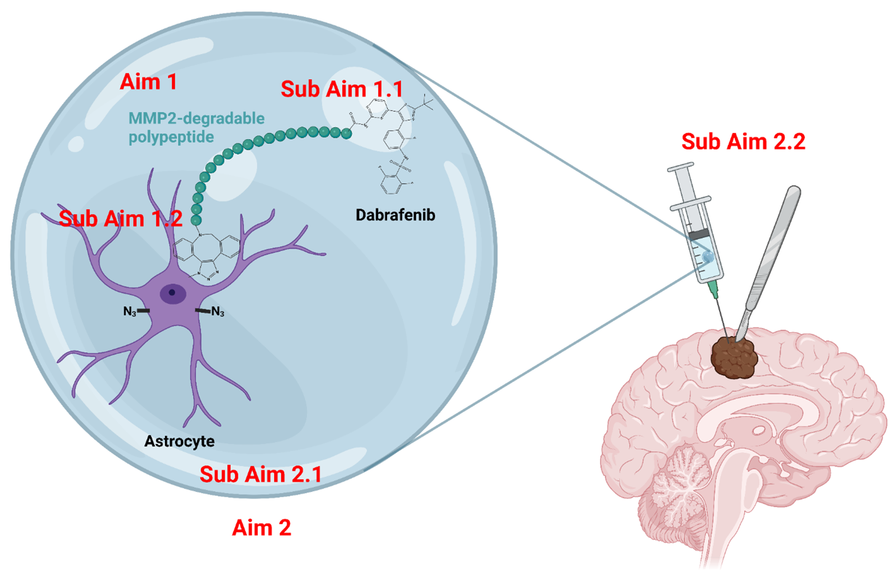

# AstrocyteBackpackTargetingMBM
Dabrafenib has been employed as a common treatment for melanoma brain 
metastasis (MBM) through 
oral administration. However, its efficacy and DOR have been substantially compromised due to limited drug delivery to the cranial space. Our microgel-protected migratable astrocyte backpacks feature two tiers of niche-responsive conjugations: acid-sensitive microgel and MMP-2-responsive linker between astrocyte and dabrafenib. Upon intracranial injection, these conjugations will facilitate the gradual release of the astrocyte backpacks loaded with dabrafenib in proximity to melanoma cells in the MBM tumors, achieving specific drug delivery, elevating intratumor drug concentrations, and extending the dabrafenib half-life. This approach aims to prolong the DOR of dabrafenib while minimizing the risks associated with adverse systemic effects, drug resistance, and relapses. In summary, this innovative pathway holds the potential to introduce a novel strategy for targeted drug delivery and, consequently, may enhance the overall outcomes for MBM patients.

*Targeted drug delivery via astrocyte migration to melanoma brain metastasis enhances drug specificity while reducing adverse effects.*

This GitHub page demonstrates the development and the final presentation of 
this 
project.
We hope 
our project can inspire future researchers to dig in 
more and explore additional exciting possibilities in this 
interdisciplinary field between pharmacology and biomedical engineering.